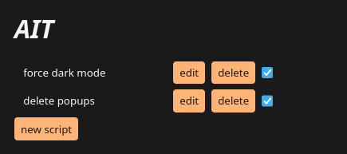

# _AIT_ Injects Things

A firefox extension that injects arbitrary javascript snippets on page load (document_start).



## Dev

[build](build) uses `npx` to run official Mozilla `web-ext` npm package.

```sh
# Build extension
./build

# Build and run extension
./build -r
```
